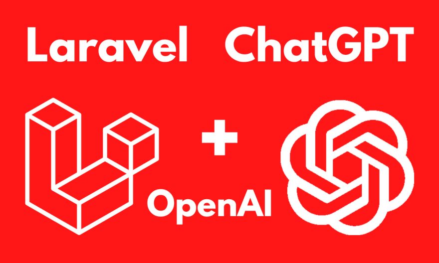

## Tutorial
[Using ChatGPT in a Laravel 10 project](https://dev.to/jeromew90/using-chatgpt-in-a-laravel-10-project-ng8)

## Installation
1. Install dependencies
```
composer install
```
2. Copy the .env and set your CHATGPT_API_KEY
```
cp .env.example .env
```
3. Generate Laravel key
```
php artisan key:generate
```

## Access
[http://127.0.0.1:8000/chatgpt](http://127.0.0.1:8000/chatgpt)
